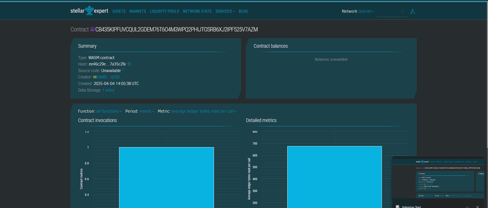

# Blockchain-Based Land Registry Smart Contract

## Table of Contents
- [Project Title](#project-title)
- [Project Description](#project-description)
- [Project Vision](#project-vision)
- [Key Features](#key-features)

## Smart Contract
Contract Add = CB435KIPFUVCQUL2GDEM76T6O4M3WPQ2PHIJTOSRB6XJ2IPF525V7AZM

https://stellar.expert/explorer/testnet/contract/CB435KIPFUVCQUL2GDEM76T6O4M3WPQ2PHIJTOSRB6XJ2IPF525V7AZM

## Project Title
**Blockchain-Based Land Registry**

## Project Description
A decentralized application (dApp) designed to lease physical or digital assets using the Stellar blockchain. Asset owners can lease out items in exchange for Lumens (XLM). The smart contracts manage the lease terms, payments, and automatic returns of leased assets, providing a secure and transparent way to handle leasing transactions.

## Project Vision
The vision of this project is to revolutionize the way physical and digital assets are leased by leveraging blockchain technology. It aims to make asset leasing accessible, transparent, and efficient by using smart contracts to automate the leasing process, ensuring that all parties involved adhere to the terms of the contract. Through this platform, users can lease assets with confidence, knowing that all lease conditions are enforced by blockchain-based smart contracts, without the need for intermediaries.

## Key Features
1. **Decentralized Leasing**: Asset owners can lease their physical or digital assets directly to lessees through smart contracts on the Stellar blockchain.
  
2. **Automated Lease Terms**: The smart contracts handle all lease-related actions, including contract creation, payments, and automatic asset return when the lease period ends.
  
3. **Payment in Lumens (XLM)**: All leasing transactions are made using Lumens (XLM), the native cryptocurrency of the Stellar network, ensuring low-cost and fast transactions.
  
4. **Transparency and Security**: Smart contracts ensure all lease terms are transparent and automatically enforced, reducing the potential for fraud or disputes between parties.

5. **Ownership and Return Management**: Asset ownership is tracked through the blockchain, and the system ensures that assets are returned to the owner automatically at the end of the lease term.

6. **Cross-Border Leasing**: The use of the Stellar blockchain enables global leasing possibilities without the need for traditional financial intermediaries or currency exchange complexities.

7. **Auditability**: The entire leasing process is stored on the blockchain, providing an immutable record of all transactions and actions, which ensures accountability and allows for audits.

---

## Soroban Smart Contract Implementation

To implement this project using the Soroban SDK for the Stellar blockchain, the smart contract will include the following functionalities:
- **Lease Creation**: Asset owners will be able to create new leases, setting the terms (such as lease duration and payment) in a smart contract.
- **Lease Payment Handling**: Lessees can pay in Lumens (XLM) as per the terms specified in the lease agreement.
- **Automatic Lease Expiry & Return**: Once the lease term expires, the contract will automatically trigger the return of the asset to the owner and update the lease status.
- **Approval & Dispute Resolution**: Admins or authorized users will have the ability to approve leases and resolve any disputes that arise during the leasing process.

